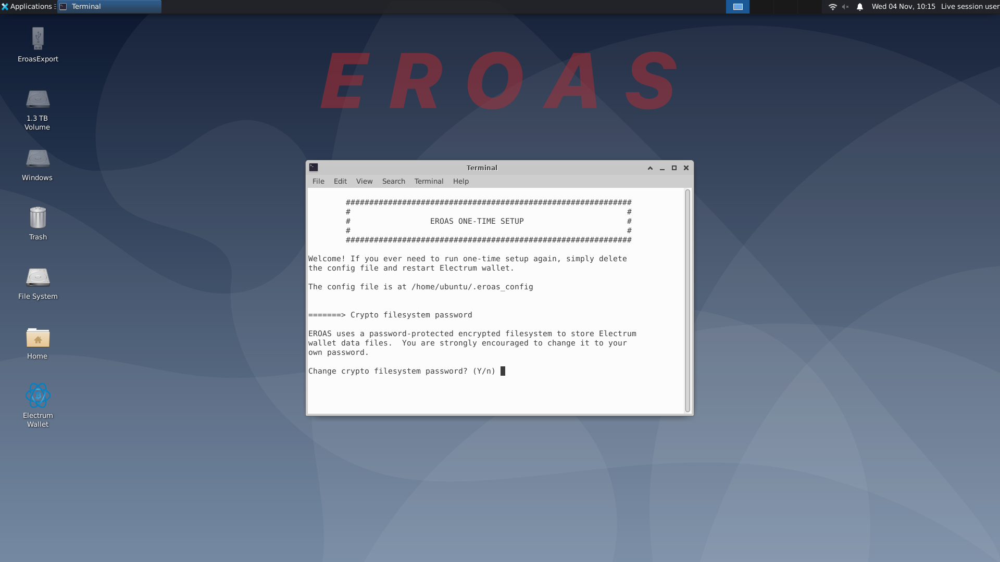
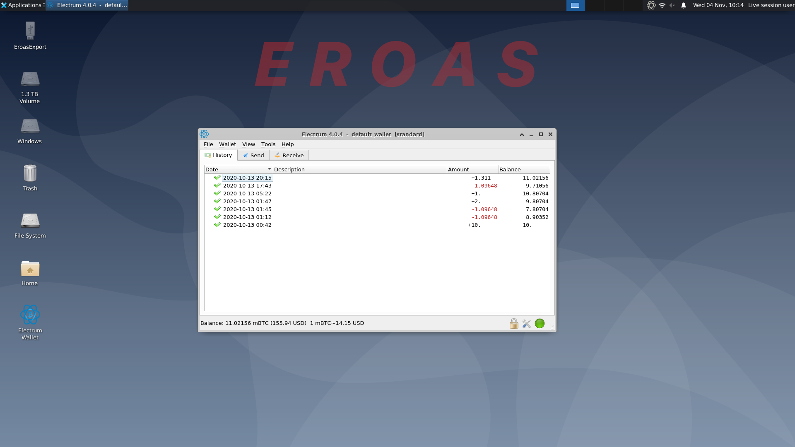

 |
----------------|------------

# EROAS

EROAS stands for "Electrum Running On A Stick". 
It runs Electrum wallet, the best open source bitcoin wallet, on cheap USB drives,
with cold-wallet level security and hot-wallet like convenience.
It is meant to operate like a saving account for infrequent transactions (perhaps <1 transaction per day).
Its strong security level makes it suitable to protect assets over millions of dollars.

### Networking modes:

EROAS supports 4 networking modes:

- Connect to Electrum open network directly (default)
- Use Tor to connect to Electrum open network for privacy
- Connect to a designated Electrum server directly for trust/privacy
- Connect to a designated Electrum server via SSH tunnel for trust/privacy (advaned)

Strict firewall rules are imposed. 
- No incoming connections
- Outgoing connection is allowed for port 53 (DNS) and optional 80/443 (HTTP/HTTPS). 
- Additional outgoing traffic is as allowed based on networking mode
    - For direct connect mode, port 50002 is allowed
    - For Tor mode, port 9001 is allowed
    - For single server mode, connection to the server IP is allowed at Electrum port (50002) or ssh port (22)

### Security features

- The system image is an unmutable ISO image, resistent to all persistent attacks. 
    - No root user or sudoer in the whole system!
    - Persistent partition is mounted for /home (user data) only
- Electrum data files are stored in a password-protected crypto file system 
- Support fingerprint-protected secure drive for additional security
- Strict firewall enforcement
- Use Tor for additional privacy and security
- Support designated electrum server mode
    - You can own a [dedicated electrum server easily on AWS](https://aws.amazon.com/marketplace/pp/B08PZ7MVMS?qid=1609886178597)
    - Alternatively, [you can set up such a server on a raspberry pi 4](http://junsun.net/wordpress/2021/01/setup-bitcoin-electrum-lightning-network-on-raspberry-pi-4/)
- Leverage usual security measures in Electrum wallet (e.g, wallet password)
- Every piece of code is open source and everyone can build from scratch
- Use general purposed and open architecture hardware (PC/Mac/USB disks).  No proprietary code or hardware.
- support both Mac and PC

### Flash USB drive

- Get a spare USB drive with 2GB or bigger.
    - Backup exiting data as the whole drive will be wiped away.
    - USB 3.0 or above drive is strongly recommended for fast run-time speed.  
    - You can also look into fingerprint-protected or keypad protected USB drives for addtional security. 
- Download [the latest EROAS ISO image](http://junsun.net/misc/latest-eroas.html)
    - Optionally you can build EROAS ISO image yourself relatively easily. See Instructions below.
- Download/install [Etcher](https://www.balena.io/etcher/) and use it to flush the ISO image to USB drive.
    - Etcher runs on Mac, Windows and Linux.
    - Windows users can also use [rufus](https://rufus.ie/).  Use all default options and choose "dd" method to do the final flashing.
    - Linux users can simply use dd command (e.g., "sudo dd if=eroas-v0.8.0-20201018-152032.iso of=/dev/sdb bs=4M")
- To flush into fingerprint-protected or keypad-protected secure drive, unlock secure dirve first.  Select the secure drive as the flushing target.

Mac users please refer to additional instructions at [this link](https://itsfoss.com/create-bootable-ubuntu-usb-drive-mac-os) and [this link](https://tails.boum.org/doc/first_steps/start/mac/index.en.html)

### Use EROAS

- Insert EROAS USB drive into PC/MacBook and boot from USB drive.
    - Different machines have different methods for this step.   
    - Refer to [a quick guide](https://www.acronis.com/en-us/articles/usb-boot/) and [a more comprehensive guide](https://neosmart.net/wiki/boot-usb-drive/)
- First time booting up, you may need to set up wifi connection.  
    - On the top right corner, click on an icon with 2 arrows to set it up.
- Click on the Electrum launcher icon on Desktop to run Electrum. 
    - For the first time running, you will go through a setup process.
- Follow Electrum GUI, set up your wallets, and perform transactions accordingly
- Afterwards shut down the machine and unplug the USB drive.

Note :
- In Tor networking mode, it may take up to 1 or 2 minutes for Electrum to make an initial connection to Electrum network.
- USB drive has an FAT32 "EroasExport" partition, useful for importing/exporting data

### Disk partitions

USB drive is divided into 3 partitions
1. EFI partition : ~1GB, FAT32, contains casper rootfs, linux and initrd
1. Home partition : 512MB,  ext4, among which 128MB is reserved for Electrum crypto fs
1. Data exchage : the rest of disk, FAT32, for exchanging data with other computers

### Build ISO image

- Have a ubuntu 20.04 host
    - other debian-based distro could work, but not tested and may need minor changes
    - no GUI necessary (e.g, AWS ubuntu 20.04 server suffices)
- git clone https://github.com/monkey-jsun/eroas.git
- cd eroas
- ./build_eroas.sh -
- During the build you will be presented a few screens of choices.  Always choose the default, except for the followings
    - "Configuring locales" screen #1 : select "end_US ISO-8859-1" and "en_US.UTF-8 UTF-8"
    - "Configuring locales" screen #2 : select "C.UTF-8"

### Donation and Channel Connect on Lightning Network
If you find this work is useful, please feel free to make a donation or open a channel with my Lightning Network node.

For donation, Bitcoin wallet address is "bc1qyc48kmpweyx2kpqhq8n6r0ckr2fqsfvz2qxpx4"

 

